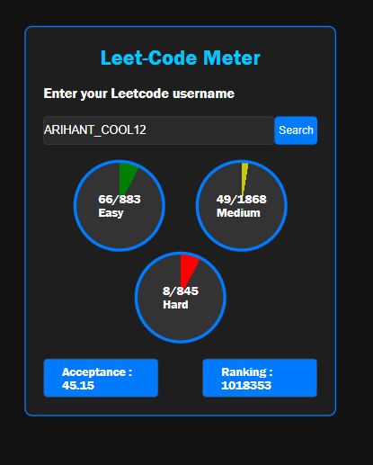

# LeetCode Metrics

LeetCode Metrics is a simple and effective tool to visualize your LeetCode problem-solving progress. It provides a clear breakdown of problems solved by difficulty — Easy, Medium, and Hard — helping you track consistency, measure growth, and showcase your coding discipline.

#   Screenshot 
 

## Features

- Displays the total number of problems solved on LeetCode
- Categorizes solved problems by difficulty: Easy, Medium, Hard
- Helps monitor progress and prepare for technical interviews
- Minimalistic and user-friendly interface

## Technologies Used

- **HTML5:** Semantic markup for structured and accessible content.  
- **CSS3:** Responsive styling using Flexbox and custom themes.  
- **JavaScript (ES6+):** DOM manipulation, event handling, and local storage for state persistence.  
- **API Integration:** Fetches real-time LeetCode data using REST API calls to dynamically display problem-solving statistics.

## Usage

1. Clone the repository:
   ```bash
   git clone https://github.com/jainArihant12/Leetcode_Metrics.git